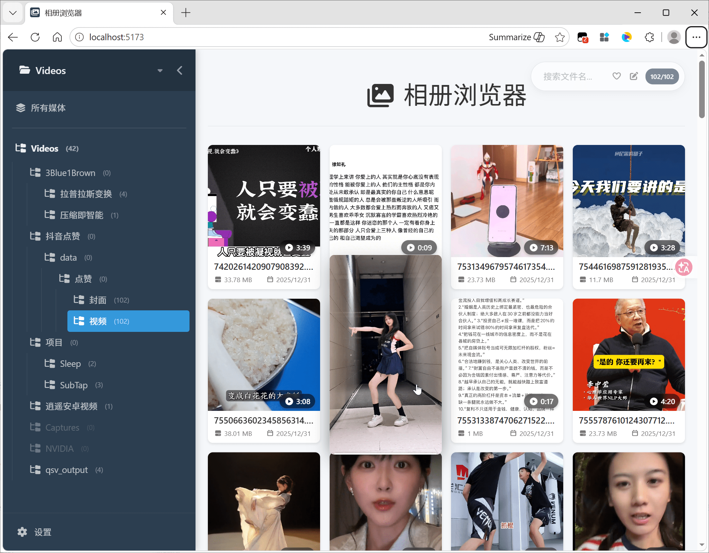

# 🖼️ 相册浏览器 (Gallery Viewer)



> 纯本地、不联网的媒体相册浏览器 —— 打开文件夹即看，拖拽重排、序号改名、收藏备注、EXIF/GPS 一站式整理本地图库。

## 开发动机

一开始，就是电脑上下了不少套图，一个文件夹几百张，双击用看图软件一张张翻——一套图里好看的、不好看的混在一起，这种查看、管理的效率，实在不爽。

于是就有了 Gallery Viewer：打开一个文件夹，便捷地预览、查看、管理——文件全在本地，不上传，隐私也安心。不顺眼的随手删，删错了还能撤销。后来发现，它其实能管起整个媒体库：从网上搜罗的音乐、视频合集，手机备份到电脑上的相册，都能往里一扔，统一浏览管理。

再后来，发现有些套图的照片顺序不太对。于是加了**重排模式**：直接拖拽调整顺序，「应用」把序号写回文件名——一份顺序规整、能按名字排序的文件，就整理好了。

## 特性

- **📦 可安装 / 可离线** —— PWA 可装到桌面、断网可用；或单 HTML 文件，双击即开、U 盘带走
- **🛡️ 纯本地、不联网** —— File System Access API 直读本地文件夹，媒体绝不上传，隐私无忧
- **📁 多文件夹管理** —— 打开过的根文件夹都记着，侧栏一键秒切（扫描快照，零 IO）
- **🖼️ 媒体全支持** —— 图片、视频、音频
- **✂️ 文件管理** —— 重命名、删除（回收站）、拖拽移动， `Ctrl+Z` 可撤销
- **🔀 重排模式** —— 右键进入，拖拽调整顺序，完成后把序号写回文件名前缀——整理照片顺序的神器
- **⭐ 收藏 + 📝 备注** —— 按文件内容（md5）聚合，换文件夹、换根都不丢
- **ℹ️ 元数据** —— EXIF 拍摄时间、GPS 定位（Google / 高德 / 百度跳转，坐标自动纠偏）、视频分辨率 / 时长、音频 ID3
- **🎬 视频体验** —— 三种预览方式（静态帧 / 悬浮循环 / 视口自动循环）+ 速度调节

## 用法

**直接用**（任选其一）：

- 在线用：访问 [Gallery-Viewer Pages](https://haujetzhao.github.io/Gallery-Viewer/)（PWA，可安装到桌面 / 断网可用）
- 离线用：或下载 [Gallery-Viewer.html](https://github.com/HaujetZhao/Gallery-Viewer/releases/latest/download/Gallery-Viewer.html)，双击打开
- 
**本地开发**：

```bash
npm install
npm run dev          # 开发服务器（浏览器实测走 CDP，见 CLAUDE.md）
npm run build        # 产出单文件 dist/index.html（可 file:// 双击离线）
npm run build:pwa    # 产出 PWA 多文件 dist/（service worker + manifest，可安装离线）
npm run test         # Vitest 跑测试
npm run lint         # ESLint 检查
```


## 快捷键

| 操作 | 作用 |
|---|---|
| **鼠标** | |
| 左键单击卡片 | 打开大图 |
| 右键单击大图 | 关闭大图 |
| **键盘** | |
| `Ctrl+O` | 打开文件夹 |
| `Ctrl+F` | 聚焦搜索框 |
| `Ctrl+Z` | 撤销上一步操作（重命名 / 删除 / 移动） |
| `L` | 收藏 / 取消收藏 |
| `N` | 备注（打开属性面板直达备注栏） |
| `P` | 属性面板 |
| `F2` | 重命名（悬停卡片 / 大图） |
| `Delete` | 删除到回收站（可撤销） |
| 大图 `↑` / `PageUp` | 上一张 |
| 大图 `↓` / `PageDown` | 下一张 |
| 大图 `空格` | 播放 / 暂停 |
| 大图 `ESC` | 关闭大图 |
| 大图 `Ctrl+C` | 复制当前图片 |

## 兼容性

基于 **File System Access API**，以下浏览器（桌面端）全功能支持：

- **Chrome / Edge / Opera**（86+）

*Firefox / Safari 走降级只读模式*：一次选目录浏览，缩略图 / EXIF / 收藏 / 备注仍可用，但重命名 / 移动 / 删除等写回操作置灰。

